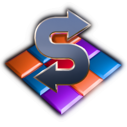

# Swap

A tribute to Microid's Sawp game from the 90's.

...I still thinks it should have been Immortal.

 Made with Godot Engine (https://godotengine.org/).

## Authors

Oxben <oxben@free.fr>

## Source tree

| Directory                  | Content                                                    |
| -------------------------- | ---------------------------------------------------------- |
| swap/                      | The godot project tree. Contains the 'project.godot' file  |
| swap/assets/playground/    | The board assets                                           |
| swap/assets/sounds/        | Sound effects                                              |
| swap/assets/textures/      | Texture files for all the assets                           |
| swap/assets/tiles/         | The tiles meshes                                           |
| swap/assets/ui/            | Resources for the game UI                                  |
| swap/scenes/               | Scenes and .gd scripts                                     |
| blender/                   | Blender files used to make the assets                      |

## Assets

Most assets in the project have been created with open source tools.
Thank you Blender, Inkscape, Gimp and Krita.

Some assets are borrowed from CC license sources. Mainly:
- Sound samples from https://freesound.org
- HDRI textures from https://polyhaven.com
